{width="4.266666666666667in"
height="3.1625in"}

**Если есть такая возможность, айпишники маски и тд которые будут
расписаны в заадниях ниже , нужно взять точно такие-же и не придумывать
что-то иное**

**Удачи!!**

**ПРЕМИЧАНИЯ К ДАННОЙ МЕТОДИЧКЕ:**

**Почти** во всех заданиях нужно что-то делать через суперпользователя
команда: su --

**Проверить** есть ли инет на машине можно командой ping 8.8.8.8 , если
инет пропал нужно ввести команду: systemctl restart networking либо же
просто перезагрузить свою машину

**Можно** использовать клавишу ТАБ и может быть она выдаст при
прописывании какой-либо команды что-то подходящее

**Если** будете копировать сам код проверять нужно обязательно
досконально

**Чтобы** продвинуться в сторону поможет клавиша ТАБ

**Обязательно** проверять скачались ли пакеты, если нет, значит слетел
инет

ЕСЛИ НЕ РАБОТАЕТ ping 8.8.8.8 НУЖНО ЗАЙТИ СЮДА: nano /etc/resolv.conf И
ТАМ НАПИСАТЬ ЭТО : nameserver 8.8.8.8

1.Созданы машинки и идти по заданиям:

**СНАЧАЛА НУЖНО ДЕЛАТЬ 1 ЗАДАНИЕ , ПОТОМ 2 , ПОТОМ 8 , ПОСЛЕ 5 задания
проводить проверку ssh.. написано в 5 задание в самом конце**

**После раздачи айпишников надо обязательно: nano /etc/sysctl.conf**

**Там надо найти net.ipv4.ip_forward = 1 и нужно у нее убрать это: \#
далее прописать в терминале sysctl -p , должно высветиться net... и тд ,
это делается на машинах :: ISP HQ-RTR BR-RTR**

**ЗАДАНИЕ № 1**

{width="6.056778215223097in"
height="2.6677832458442694in"}

\-\-\-\-\-\-\-\-\-\-\-\-\-\-\-\-\-\-\-\-\-\-\-\-\-\-\-\-\-\-\-\-\-\-\-\-\-\-\-\-\-\-\-\-\-\-\-\-\-\-\-\-\-\-\-\-\-\-\-\-\-\-\-\-\-\-\-\-\-\-\-\-\-\-\-\-\-\-\-\-\-\-\-\-\-\-\-\-\-\-\-\-\-\-\-\-\-\-\-\-\-\-\-\-\-\-\-\-\-\-\-\-\--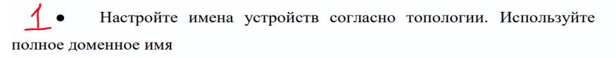{width="6.496527777777778in"
height="0.6159722222222223in"}

{width="5.213567366579178in"
height="2.3992213473315838in"}

Рисунок 1. Так нужно прописать все 6 машин добавляя на конце название
машины

И перезагрузить после команды машины

hostnamectl set-hostname ....( название машины )

\-\-\-\-\-\-\-\-\-\-\-\-\-\-\-\-\-\-\-\-\-\-\-\-\-\-\-\-\-\-\-\-\-\-\-\-\-\-\-\-\-\-\-\-\-\-\-\-\-\-\-\-\-\-\-\-\-\-\-\-\-\-\-\-\-\-\-\-\-\-\-\-\-\-\-\-\-\-\-\-\-\-\-\-\-\-\-\-\-\-\-\-\-\-\-\-\-\-\-\-\-\-\-\-\-\-\-\-\-\-\-\-\--

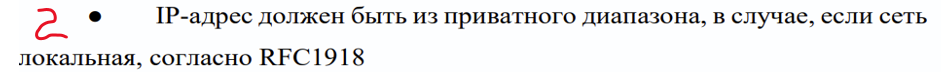{width="6.496527777777778in"
height="0.49722222222222223in"}

Для того чтобы понять от куда брать цифры и маски, нужно глянуть что
дано по заданиям, например в этом же 1 модуле во 2 задании написано :

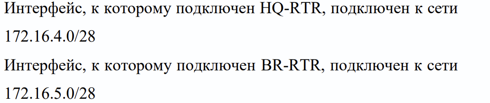{width="5.81363845144357in"
height="0.9749070428696412in"}

То есть нам уже дано HQ-RTR -- 172.16.4.**0**/28 и BR-RTR
172.16.5.**0**/28 ( Цифру **0** на конце мы никогда не используем!!! )

На рисунке чуть ниже расписаны **5 Подсетей и их айпишники ( пока что
без масок )**

**Примечания к рисунку:**

1\) Ens33 мы почти никогда не берем и не прописываем!

2\) Где не даны айпишники ( то есть по данной топологии нам даны только
HQ-RTR и BR-RTR ) оставшимся мы придумываем айпишники

Желательно как раз при создании новых айпишников по возможности выбирать
либо: 192.168.**0.0** или 172.16.**0.0 ( меняя 0 которые я выделила )**

{width="5.689188538932633in"
height="5.245989720034996in"}

Это топология сети с уже сделанными подсетями

Разберем каждую подсеть по порядку

Подсеть **№1**

{width="2.1392399387576555in"
height="2.3986111111111112in"}

Нам уже дан айпишник для HQ-RTR ( **172.16.4.0** )

так как мы не можем использовать **0** на конце , нам

нужно его поменять , проще начать сверху , поэтому

мы в конце ставим **1** ( на **ISP )** а снизу ( на **HQ-RTR** )

мы ставим уже **2** , потому что они не могут быть одинаковыми

Подсеть **№2**

{width="1.8945964566929134in"
height="2.5027777777777778in"}Здесь уже надо придумать совой айпишник ,
возьмем:

192.168.**0.0** -- эти два **0** на конце нам надо менять ,можно

Начать с **1** и так же начать сверху , то есть **192.168.1.1**

а снизу по такому же принципу оставляем предпоследнюю

цифру (**1**) так как у нас это единая подсеть и в конце меняем

на **2** ,в итоге снизу будет: **192.168.1.2**

Подсеть **№3**

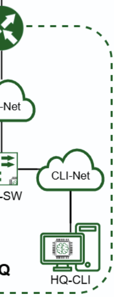{width="1.7986111111111112in"
height="2.5819444444444444in"}Берем тот же изначальный айпишник (с
подсети**№2**):

**192.168.0.0** , начнем сверху ( меняем также два **0** в конце )

Предпоследний **0** меняем на **2** ( потому что **1** уже занято )

и последний **0** меняем на **1** ,получается: **192.168.2.1**

Снизу аналогично предпоследний **0** меняем на **2**

и последний 0 меняем на **2** ,получается: **192.168.2.2**

Подсеть **№4**

{width="1.916058617672791in"
height="2.185416666666667in"}На BR-RTR нам уже был дан айпишник
**172.16.5.0**

Оставляем все что нам дано , кроме **0**, получается сверху

У нас будет **172.16.5.1** , а снизу будет **172.16.5.2**

Подсеть №5

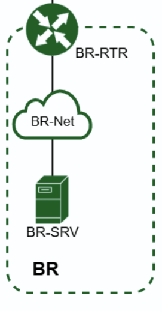{width="1.9009897200349957in"
height="2.627755905511811in"}И последняя подсеть, берем айпишники
**192.168.0.0**

Все также и аналогично меняем последние два **0**

Сверху у нас будет **192.168.3.1** ( **3** будет -- потому что
**1,2,4,5**

Уже заняты ) и снизу будет **192.168.3.2**

**В итоге вся топология сети уже разобрана, можно перейти к маскам для
всех айпишникам**

**\-\-\-\-\-\-\-\-\-\-\-\-\-\-\-\-\-\-\-\-\-\-\-\-\-\-\-\-\-\-\-\-\-\-\-\-\-\-\-\-\-\-\-\-\-\-\-\-\-\-\-\-\-\-\-\-\-\-\-\-\-\-\-\-\-\-\-\-\-\-\-\-\-\-\-\-\-\-\-\-\-\-\-\-\-\-\-\-\-\-\-\-\-\-\-\-\-\-\-\-\-\-\-\-\-\-\-\-\-\-\-\-\--**

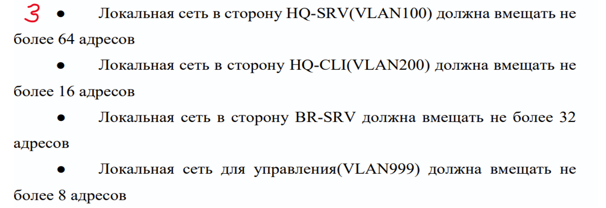{width="6.496527777777778in"
height="2.2291666666666665in"}

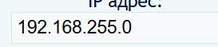{width="2.84375in"
height="0.5951388888888889in"}**VLAN мы не делаем, просто прописываем
его в таблицу!!!**

Для того чтобы понять какая у кого маска, нужно посчитать в
калькуляторе: <https://infocisco.ru/ip_calculator.php>

По **второму** заданию мы **выписали айпишники роутеров, серверов и
машины**

Пример HQ-SRV(VLAN100**) более 64 адресов** айпишник: 192.168.1.2. /
**?**

{width="5.887534995625547in"
height="3.0979549431321085in"}

Вводим нужный нам айпишник , далее где сетевая маска **выбираем маску**
исходя из **нужного кол-ва рабочих адресов** сравнивая их **с нижними
строчками**, исходя из данных действий мы должны обязательно **составить
таблицу** записывая нужные данные в том числе **которые** **остались в
топологии сети:**

  --------------------------------------------------------------------------
  Сеть                   Адрес подсети            Пул-адресов
  ---------------------- ------------------------ --------------------------
  HQ-SRV(VLAN100)        192.168.1.0/26           192.168.1.1-192.168.1.62

  HQ-CLI(VLAN200)        192.168.2.0/28           192.168.2.1-192.168.2.14

  BR-SRV                 192.168.3.0/27           192.168.3.1 --
                                                  192.168.3.30

  VLAN999                192.168.255.0/29         192.168.255.1 --
                                                  192.168.255.6

  ISP-HQ                 172.16.4.0/28            172.16.4.1 -- 172.16.4.14

  ISP-BR                 172.16.5.0/28            172.16.5.1 -- 172.16.5.14
  --------------------------------------------------------------------------

**Таблица 1 Подсети**

\-\-\-\-\-\-\-\-\-\-\-\-\-\-\-\-\-\-\-\-\-\-\-\-\-\-\-\-\-\-\-\-\-\-\-\-\-\-\-\-\-\-\-\-\-\-\-\-\-\-\-\-\-\-\-\-\-\-\-\-\-\-\-\-\-\-\-\-\-\-\-\-\-\-\-\-\-\-\-\-\-\-\-\-\-\-\-\-\-\-\-\-\-\-\-\-\-\-\-\-\-\-\-\-\-\-\-\-\-\-\-\-\--

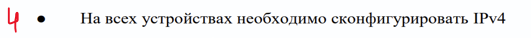{width="5.534082458442695in"
height="0.3474004811898513in"}

Нам нужно зайти в параметры у каждой машинки, добавить туда сегмент(ы)
согласно нашей топологии

Пример:

{width="2.911111111111111in"
height="2.415277777777778in"}

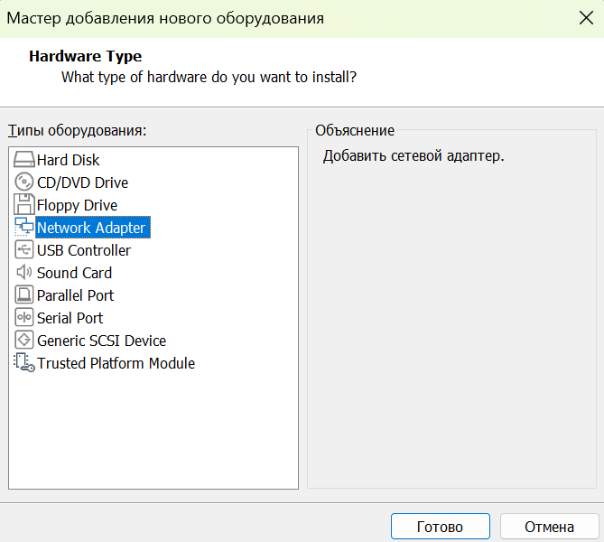{width="3.231298118985127in"
height="1.874867672790901in"}

Смотрим на топологию и на ее связь между роутером , сервером и компом и
добавляем соответствующие сегменты, например :

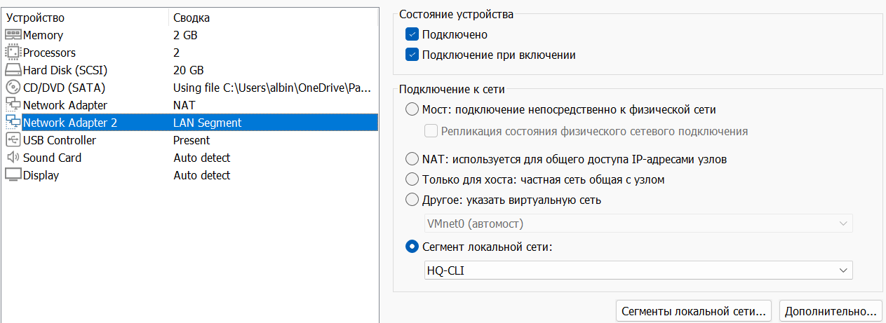{width="6.117874015748032in"
height="2.20247375328084in"}

Как определить какие нужно добавлять сегменты для каждой машинке:

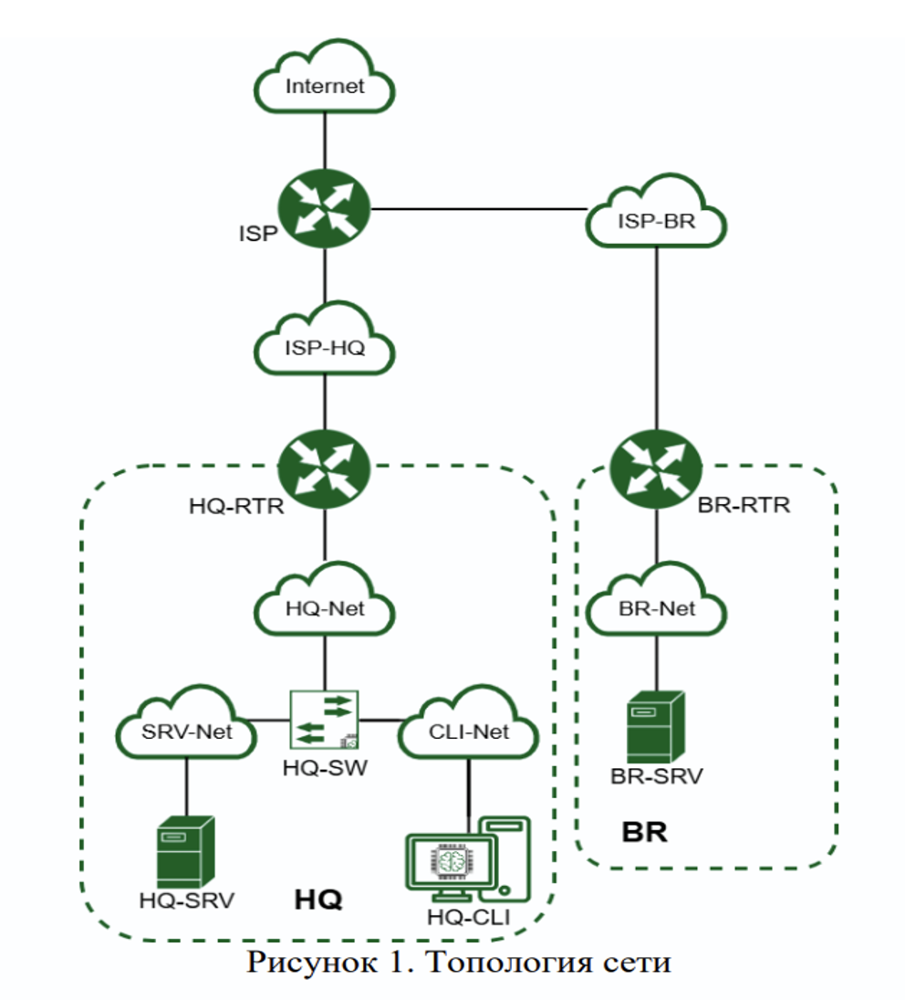{width="5.6308552055993in"
height="4.127720909886264in"}

По итогу вот такие сегменты у нас на всех машинах:

{width="1.8604166666666666in"
height="1.8590277777777777in"}**HQ-RTR:** ISP-HQ , HQ-SRV , HQ-CLI

**CLI:** HQ-CLI

**HQ-SRV:** HQ-SRV

**BR-RTR:** ISP-BR , BR-SRV

**BR-SRV:** BR-SRV

**ISP:** ISP-HQ , ISP-BR

После мы заходим в «Дополнительно» и смотрим снизу MAC-адрес

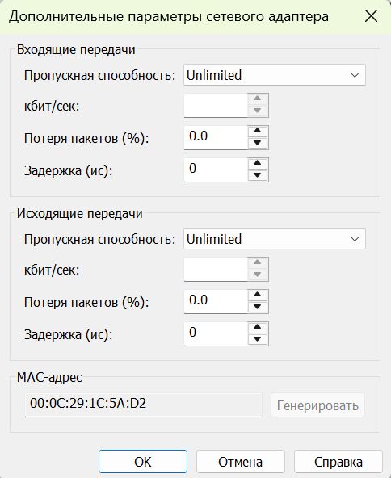{width="3.091666666666667in"
height="2.834722222222222in"} {width="2.3826093613298336in"
height="1.843001968503937in"}

После заходим обратно в терминал и вводим ip a , что у нас выходит:

{width="6.662924321959755in"
height="2.445376202974628in"}

Рисунок 3. Ищем тут нужные нам MAC-адреса , в данном случае он у нас
только 1 , это ens37, потому что на скрине чуть выше написано: 1С:5А:D2
, он у нас как раз написан в ens37

Далее мы обязательно входим в режим суперпользователя , ибо без этого не
получится , вводя: su -- и пароль

{width="4.703501749781277in"
height="2.049730971128609in"}

Пометка!!! На этом скрине после прописания адреса должно еще быть
обязательно прописано gateway 192.168.2.1

Рисунок 4**.CLI**

Рисунок 4. После мы вводим в терминале команду: **nano
/etc/network/interfaces**

У нас выходит файл конфигурация и там надо написать айпишники и маску:

\-\-\-\-\-\-\-\-\-\-\-\-\-\-\-\-\-\-\-\-\-\-\-\-\-\-\-\-\-\-\-\-\-\-\-\-\-\-\-\-\-\-\-\-\-\-\-\-\-\-\-\-\-\-\-\-\-\-\-\-\-\-\-\-\-\-\-\-\-\-\-\-\-\-\-\-\-\-\-\-\-\-\-\-\-\-\-\-\-\-\-\-\-\-\-\-\-\-\-\-\-\-\-\-\-\-\-\-\-\-\-\-\--

auto lo

iface lo inet loopback

auto ens37

iface ens37 inet static

address 192.168.2.2/28

Добавлю еще варианты с других машин:

{width="2.966666666666667in"
height="1.9194444444444445in"} ISP BR-RTR

{width="3.3055555555555554in"
height="2.1944444444444446in"}

{width="2.763888888888889in"
height="1.9375in"}{width="3.6875in"
height="1.9444444444444444in"} HQ-SRV HQ-RTR

BR-SRV

{width="4.631755249343832in"
height="1.7083628608923884in"}

**Примечание к этим рисункам!! На HQ-RTR , BR-RTR у меня там после
адреса указаны шлюзы, если после них машины не пингуются, то их надо
попробовать убрать, в общем лучше сначала не писать на этих машинах
шлюз!!!То естть шлюз прописывается 100% на: CLI , HQ-SRV , BR-SRV**

**После раздачи айпишников надо обязательно: nano /etc/sysctl.conf**

**Там надо найти net.ipv4.ip_forward = 1 и нужно у нее убрать это: \#
далее прописать в терминале sysctl -p , должно высветиться net... и тд ,
это делается на машинах :: ISP HQ-RTR BR-RTR**

После ввода мы сохраняем че мы написали с помощью:

{width="2.9754866579177603in"
height="0.47968941382327207in"} Ctrl O -- Записать изменения, Ctrl X --
Выход

Можно проверить точно ли сохранилось использовав ту же команду как и на
входе

Таким образом прописываются все машины, вводятся сначала **сегменты**,
после проверяются **MAC-адреса** , заходя в терминал пишется **ip a** ,
ищем наши **MAC-адреса** , прописываем команду : **nano
/etc/network/interfaces** , далее **пишем** записи чуть выше , после
**сохр** это и **выходим**. ( можно в конце всего проверить командой:
**systemctl restart networking ,** если все оке , то **ничего** не
высветиться )

Подробная таблица по итогу со 2 подпункта по 4:

+-------------+-------------+-------------+-------------+-------------+
| ISP         | Ens37       | 172.16.4.1  | /28         |             |
|             |             |             |             |             |
|             | Ens38       | 172.16.5.1  | /28         |             |
+=============+=============+=============+=============+=============+
| HQ-RTR      | Ens 37      | 172.16.4.2  | /28         | 172.16.4.1  |
|             |             |             |             |             |
|             | Ens 38      | 192.168.1.1 | /26         |             |
|             |             |             |             |             |
|             | Ens 39      | 192.168.2.1 | /28         |             |
+-------------+-------------+-------------+-------------+-------------+
| BR-RTR      | Ens 37      | 172.16.5.2  | /28         | 172.16.5.1  |
|             |             |             |             |             |
|             | Ens 38      | 192.168.3.1 | /27         |             |
+-------------+-------------+-------------+-------------+-------------+
| HQ-SRV      | Ens 37      | 192.168.1.2 | /26         | 192.168.1.1 |
+-------------+-------------+-------------+-------------+-------------+
| HQ-CLI      | Ens 37      | 192.168.2.2 | /28         | 192.168.2.1 |
+-------------+-------------+-------------+-------------+-------------+
| BR-SRV      | Ens 37      | 192.168.3.2 | /27         | 192.168.3.1 |
+-------------+-------------+-------------+-------------+-------------+

**Таблица 2 Адреса**

**(По этой таблице шлюзы для HQ-RTR и BR-RTR они на всякий случай , если
машина не будет пинговаться, сначала надо пробовать без них!!)**

1 строчка -- идут сами машинки

2 строчка -- это интерфейсы машинок

3 строчка -- это как раз айпишники этих интерфейсов

4 строчка -- маски айпишников

5 строчка -- шлюз

Как понять откуда брать шлюз?

-Роутеры у нас так то не должны иметь шлюз, но они помогают определить
шлюз для других машинок , например: берем роутер HQ-RTR и HQ-SRV , нам
нужен шлюз на HQ-SRV , смотрим какой айпишник у HQ-SRV очень похож у
HQ-RTR , и его записываем с роутера

То есть для каждой машины где нужен шлюз мы так-же прописываем в
терминале и через команду nano /etc/network/interfaces :

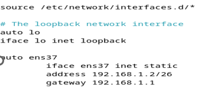{width="6.152712160979878in"
height="2.4549945319335085in"}

Нужно проверить связь этих машин друг с другом, для этого надо написать
ping и айпишник ( без маски ) машинки , по идее они все должны видеть
друг друга

Если ввести ping 8.8.8.8 оно не будет работать без сделанного 2
заадния!!! Только потом проверять надо обязательно!!!

\-\-\-\-\-\-\-\-\-\-\-\-\-\-\-\-\-\-\-\-\-\-\-\-\-\-\-\-\-\-\-\-\-\-\-\-\-\-\-\-\-\-\-\-\-\-\-\-\-\-\-\-\-\-\-\-\-\-\-\-\-\-\-\-\-\-\-\-\-\-\-\-\-\-\-\-\-\-\-\-\-\-\-\-\-\-\-\-\-\-\-\-\-\-\-\-\-\-\-\-\-\-\-\-\-\-\-\-\-\-\-\-\--

**ЗАДАНИЕ № 2**

{width="6.5007239720035in"
height="1.075838801399825in"}

{width="5.696698381452318in"
height="1.7006332020997375in"}

\-\-\-\-\-\-\-\-\-\-\-\-\-\-\-\-\-\-\-\-\-\-\-\-\-\-\-\-\-\-\-\-\-\-\-\-\-\-\-\-\-\-\-\-\-\-\-\-\-\-\-\-\-\-\-\-\-\-\-\-\-\-\-\-\-\-\-\-\-\-\-\-\-\-\-\-\-\-\-\-\-\-\-\-\-\-\-\-\-\-\-\-\-\-\-\-\-\-\-\-\-\-\-\-\-\-\-\-\-\-\-\-\--

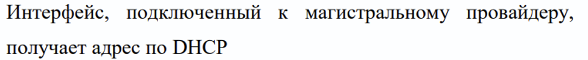{width="6.218663604549431in"
height="0.49080380577427823in"}

Пишем команду ip a

{width="6.496527777777778in"
height="1.5402777777777779in"}

**Динамический**- автоматически раздается

**Статический** -- нужно самим настраивать , например : {width="3.615087489063867in"
height="0.739686132983377in"}То что прописывается в файле конфигурации

\-\-\-\-\-\-\-\-\-\-\-\-\-\-\-\-\-\-\-\-\-\-\-\-\-\-\-\-\-\-\-\-\-\-\-\-\-\-\-\-\-\-\-\-\-\-\-\-\-\-\-\-\-\-\-\-\-\-\-\-\-\-\-\-\-\-\-\-\-\-\-\-\-\-\-\-\-\-\-\-\-\-\-\-\-\-\-\-\-\-\-\-\-\-\-\-\-\-\-\-\-\-\-\-\-\-\-\-\-\-\-\-\--

{width="6.5645483377077865in"
height="0.8313998250218723in"}

Это мы делали , когда раздавали айпишники и маски в 4 задании

\-\-\-\-\-\-\-\-\-\-\-\-\-\-\-\-\-\-\-\-\-\-\-\-\-\-\-\-\-\-\-\-\-\-\-\-\-\-\-\-\-\-\-\-\-\-\-\-\-\-\-\-\-\-\-\-\-\-\-\-\-\-\-\-\-\-\-\-\-\-\-\-\-\-\-\-\-\-\-\-\-\-\-\-\-\-\-\-\-\-\-\-\-\-\-\-\-\-\-\-\-\-\-\-\-\-\-\-\-\-\-\-\--

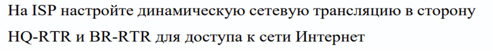{width="6.496527777777778in" height="0.6875in"}

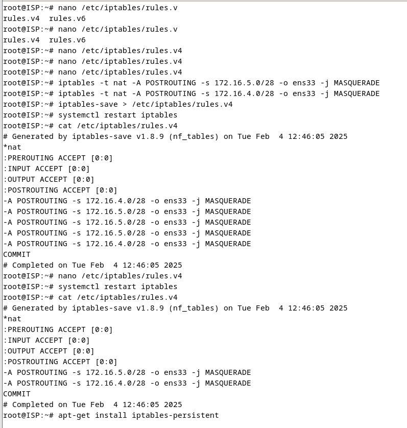{width="6.496527777777778in"
height="6.830555555555556in"}

Где стрелочка это в конце нужно записать после iptables -t nat -A и так
далее

В итоге :

1\. apt-get install iptables-persistent

2\. iptables -t nat -A POSTROUTING -s
[172.16.5.0/28](https://vk.com/away.php?to=https%3A%2F%2F172.16.5.0%2F28&utf=1)
-o ens33 -j MASQUERADE\
3. iptables -t nat -A POSTROUTING -s
[172.16.4.0/28](https://vk.com/away.php?to=https%3A%2F%2F172.16.4.0%2F28&utf=1)
-o ens33 -j MASQUERADE\
4. iptables-save \> /etc/iptables/rules.v4

5\. systemctl restart netfilter-persistent\
6. systemctl restart iptables

7\. cat/etc/iptables/rules.v4

Далее заходим на машины HQ-RTR , BR-RTR и там нужно прописать

На HQ-RTR:

up ip route add 172.16.4.0/28 via 172.16.5.1

BR-RTR

up ip route add 172.16.5.0/28 via 172.16.4.1

Если это не будет работать, то удалить надо это , можно к ним приписать
шлюз

{width="3.1380030621172352in"
height="2.5163167104111985in"}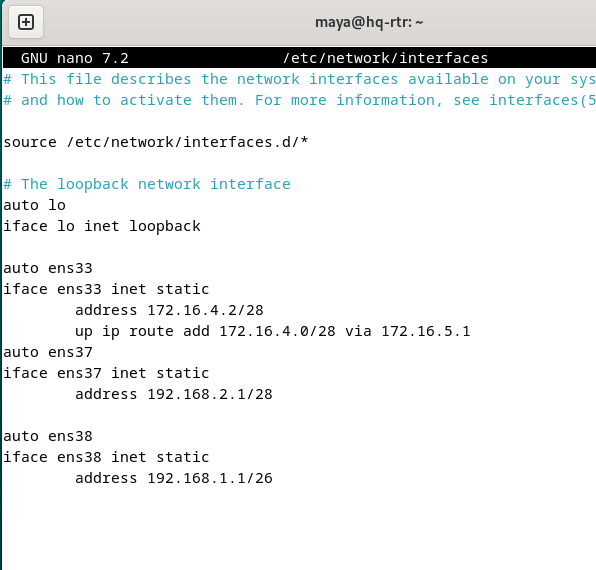{width="2.9936712598425195in"
height="2.5125in"}

\-\-\-\-\-\-\-\-\-\-\-\-\-\-\-\-\-\-\-\-\-\-\-\-\-\-\-\-\-\-\-\-\-\-\-\-\-\-\-\-\-\-\-\-\-\-\-\-\-\-\-\-\-\-\-\-\-\-\-\-\-\-\-\-\-\-\-\-\-\-\-\-\-\-\-\-\-\-\-\-\-\-\-\-\-\-\-\-\-\-\-\-\-\-\-\-\-\-\-\-\-\-\-\-\-\-\-\-\-\-\-\-\--

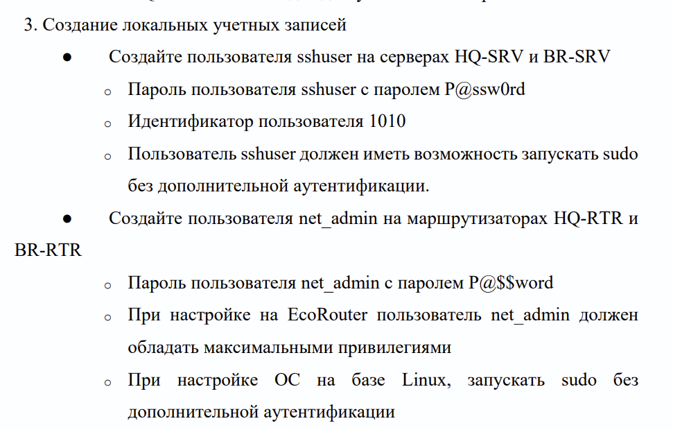{width="6.496527777777778in"
height="4.021334208223972in"}

Начнем с настройки **HQ-SRV** и потом **аналогично** прописать на **BR
-SRV**

{width="6.496527777777778in"
height="0.8763888888888889in"}

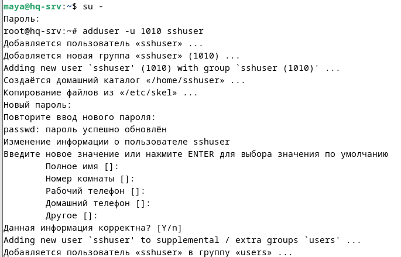{width="6.496527777777778in"
height="4.163194444444445in"}

**На этом скрине происходит:**

1\. Вход в суперпользователя

2\. Создание нового пользователя sshuser с индикатором 1010

3\. Создание пароля дня этого пользователя , обязательно
P**@**ssw**0**rd

**Итог:**

**Su --**

**adduser -u 1010 sshuser**

**Пароль : P@ssw0rd**

{width="6.520089676290464in"
height="5.134160104986877in"}

**cat /etc/passwd**

Нужно проверить сохранилось ли **1010 sshuser** , вводя эту команду: cat
/etc/passwd и проверяем на конце sshuser 1010

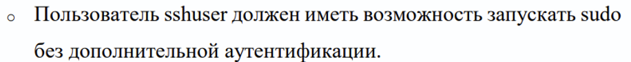{width="6.511983814523185in"
height="0.488500656167979in"}

Сначала входим в файл для выдачи прав пользователя:

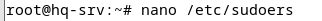{width="3.3546347331583553in"
height="0.21878062117235345in"}

Прописываем sshuser ALL=(ALL:ALL) NOPASSWD: ALL

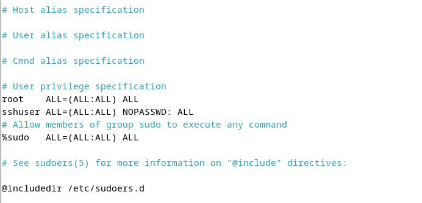{width="5.910657261592301in"
height="2.314864391951006in"}

После обязательно проверяем сработала ли та команда, чтобы у нас не
запрашивали пароль, прописав это:

{width="4.495234033245844in"
height="1.0162915573053368in"}

su -- sshuser

sudo whoami

Если есть какие-то ошибки вот варианты их решений:

{width="3.0819444444444444in"
height="4.069620516185477in"}{width="2.9868055555555557in"
height="4.056961942257218in"}

{width="3.1455697725284337in"
height="4.151388888888889in"}{width="2.8797462817147856in"
height="4.170833333333333in"}

{width="3.176909448818898in"
height="2.4873425196850394in"}{width="2.8986111111111112in"
height="4.088607830271216in"}

{width="6.5211843832021in"
height="1.5692246281714786in"}

Начало с **HQ-RTR** и аналогично нужно прописать на **BR-RTR**:

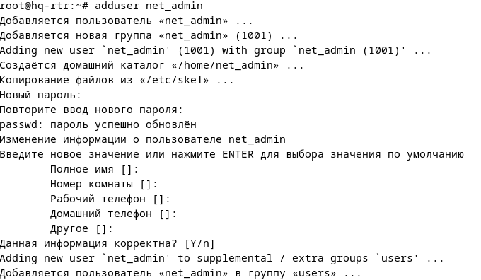{width="6.513505030621173in"
height="2.779335083114611in"}

**На этом скрине происходит:**

1.Вход в суперпользователя ( на скрине этого нет, а так он почти везде
нужен )

2\. Добавление нового пользователя net_admin ( где написаны там: полное
имя, номер телефона и тд это все на enter )

3\. Задание нового пароля обязательно **P@\$\$word**

**Итог:**

**Su --**

**adduser net_admin**

**Пароль: P@\$\$word**

После входим сюда:

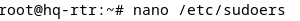{width="3.125436351706037in"
height="0.21878062117235345in"}

Прописываем net_admin ALL=(ALL:ALL) NOPASSWD: ALL

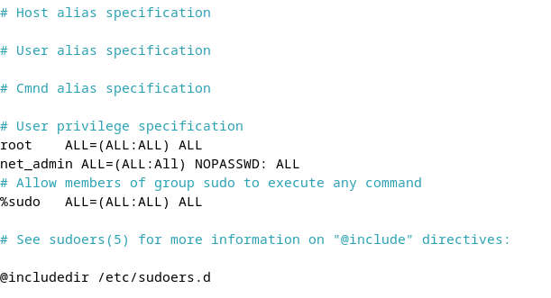{width="6.374353674540682in"
height="3.0363003062117238in"}

**Проверяем работоспособность** прошлой команды ,нужно чтобы **не
спрашивали пароль**

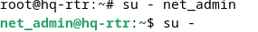{width="2.96916447944007in"
height="0.3750524934383202in"}

{width="3.135854111986002in"
height="0.9167946194225722in"}

Все супер пупер вышлоооо

{width="6.496527777777778in"
height="2.2527777777777778in"}

Заходим на HQ-RTR и прописываем эту команду:

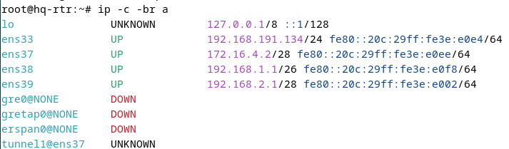{width="6.496527777777778in"
height="1.9041666666666666in"}

У нас полсе выполнение следущюих действий **должно появится еще 2ens** ,
для этого **делаем дальше**:

Далее мы с помощью команды : **nmtui** входим в какую-то штуку и
выбираем **изменить подключение**

{width="3.183333333333333in"
height="2.3222222222222224in"}

{width="3.1988681102362206in"
height="1.987257217847769in"}

После мы должны **добавить 2 VLANA** ( **VLAN-SRV и VLAN-CLI** )

Сначала заполним **VLAN-SRV** , нам нужно посмотреть **на таблицу 2**:

{width="5.91972987751531in"
height="1.2635914260717411in"}

Нам нужно понять **какой интерфейс подходит для SRV** , сначала
**смотрим на** него и его **айпшшник**, пока что **не смотря на
последнию цифру** и идем искать **похожее у HQ-RTR** , в данном слуачее
**подходит ens38** , записываем его в устройство , пишем **100 на
конце** , потому что это по заданию ( Сервер **HQ-SRV** должен находится
в ID VLAN **100** )

Далее нам **нужен MAC-адрес**: Заходим в **парамерты машины HQ-RTR** ,
находим наш **ЛАН-СЕГМЕНТ**, нажимаем **дополнительно** (**таким же
способом делаем далее**)

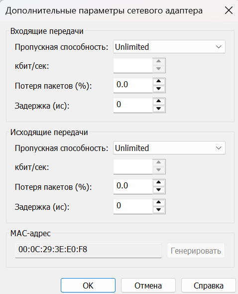{width="2.5861111111111112in"
height="1.8416666666666666in"}У нас высвечивается такая штука, и внизу
написан как раз **MAC-адрес**, мы его **копируем**

И должны его вставитть в **клонированный mac-адрес** , далее **MTU пишем
2000**

Где написал **Адрес** мы пишем адрес **192.168.1.1** и маску **/26** ,
все , нажимаем **ок**!

{width="6.502465004374454in"
height="4.550308398950131in"}

Таким же способом и образом мы прописываем это на машине **HQ-RTR**
добавляя туда **VLAN-CLI**

{width="6.496527777777778in"
height="3.5902777777777777in"}

Заходим на машины: **CLI и HQ-SRV** , добавляем: **VLANCONNECT на эти 2
машины**

{width="4.1672484689413825in"
height="4.750662729658792in"}

**HQ-CLI** Прописываем все как на скрине ( **меняться может устройство и
200** )

{width="6.035738188976378in"
height="2.0210356517935257in"}

**HQ-SRV** все так же как и написано выше

{width="5.999577865266842in"
height="2.018746719160105in"}

Далее на использованных машин для прописания VLAN мы проверяем с помощью
первой команды: ip -c br a , если там что-то добавилось , то все супер,
если нет , нужно внимательно перепроверить

Итог: На каждой используемой машине **должно добавится VLANы**

{width="3.0555555555555554in"
height="1.1180555555555556in"} HQ-RTR CLI

{width="3.2777777777777777in"
height="1.1041666666666667in"}

HQ-SRV

{width="6.496527777777778in"
height="0.9055555555555556in"}

Можно на всякий случай машины из задания 4 пропинговать между собой
,если все ок , они будут пинговаться

{width="6.548907480314961in"
height="0.6136034558180228in"}

{width="4.859928915135608in"
height="0.9692136920384952in"}

{width="4.816870078740157in"
height="1.6949770341207349in"}

apt-get install ssh

На машине **HQ-SRV** сначала входим в **суперпользователя** и
прописываем команду: **apt-get install ssh ,** у нас должны скачаться
какие-то там пакеты **хз ваще**

После входим в эту хуйню :

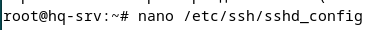{width="3.813448162729659in"
height="0.29076662292213473in"}

nano /etc/ssh/sshd_config

И прописываем:

Port 2024

MaxAuthTries 2

PasswordAuthentication yes

Banner /etc/ssh/banner

AllowUsers sshuser

{width="4.839035433070866in"
height="2.1367465004374453in"}

После входим сюда:

{width="3.5629975940507435in"
height="0.1875262467191601in"}

{width="3.323380358705162in"
height="0.6771773840769904in"}

( изначально она пустая ) и там нужно написать это: **Authorized access
only**

{width="6.5097747156605426in"
height="3.7460837707786525in"}

systemctl restart ssh

systemctl status ssh

С помощью команд на скрине мы делаем **перезагрузку ssh**

Это обязательно в конце: (hq-srv) ssh <sshuser@192.168.3.2> -p 2024

\-\-\-\-\-\-\-\-\-\-\-\-\-\-\-\-\-\-\-\-\-\-\-\-\-\-\-\-\-\-\-\-\-\-\-\-\-\-\-\-\-\-\-\-\-\-\-\-\-\-\-\-\-\-\-\-\-\-\-\-\-\-\-\-\-\-\-\-\-\-\-\-\-\-\-\-\-\-\-\-\-\-\-\-\-\-\-\-\-\-\-\-\-\-\-\-\-\-\-\-\-\-\-\-\-\-\-\-\-\-\-\--

{width="6.080744750656168in"
height="0.9707709973753281in"}

Туннель мы будем делать в HQ-RTR и BR-RTR

{width="6.395138888888889in"
height="3.0230774278215224in"}

ТО ЧТО Я ПОЧЕРКНУЛА ЭТО МЫ ПРИДУМАЛИ ,НУЖНО ИХ ЖЕ ИСПОЛЬЗОВАТЬ

На рисунке изображены **2 машины ( HQ-RTR и BR_RTR )** и между ними идет
как раз **туннель** ( обязательно пишем **tunnel1** ), верхние айпишники
172.16.4.2 -- это ens37 , относится к **HQ-RTR** , а 172.16.5.2 -- это
ens37 , относится к **BR-RTR** , верхняя стрелочка с двумя кончиками
показывает направление , где нужно начать и закончить, для **HQ-RTR**
она идет **🡪**, то есть первое - 172.16.4.2 , второе - 172.16.5.2 и
**также наоборот**

Начнем с BR-RTR

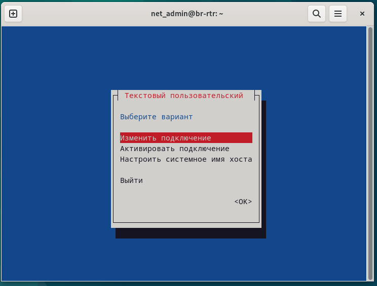{width="6.50719706911636in"
height="3.981554024496938in"}

Через команду nmtui мы входим в какую-то штуку и **выбираем изменить
подключение**

{width="4.1489851268591424in"
height="4.19305883639545in"}

Далее тут пока нихуя нет , мы нажимаем на **«Добавить»**

{width="6.198781714785651in"
height="4.750662729658792in"}

Выбираем нам нужный **«Ip-туннель»**

{width="6.496527777777778in"
height="4.877083333333333in"}

ТУТ НЕ ЗАБЫТЬ ГДЕ КОНФИГУРАЦИЯ ВЫБРАТЬ ВРУЧНУЮ

ТУТ еще надо нажать кое-где КРЕСТИК смотреть через 1 скрин

И заполняем все по порядку:

1\. Где имя профиля пишем tunnel1 аналогично на устройстве

2\. Режим мы выбираем GRE

3\. Родительский пишем ens37

4\. Локальный айпишник -- 172.16.5.2

5\. Удаленный айпишник -- 172.16.4.2

6\. Где конфигурация выбираем «вручную»

7\. Заполняем Адрес 172.16.4.0.2/24

8\. Шлюз 172.16.0.1 , маску мы тут не пишем

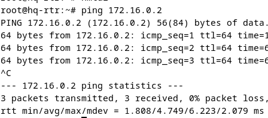{width="4.667318460192476in"
height="2.0523698600174978in"}

ВСЕ В КОНЦЕ СДЕЛАННОГО ТУНЕЛЯ ПИНГОВАТЬ НАДО ТО ЧТО ВПИСЫВАЛАСЬ ПОСЛЕ
КОНФИГУРАЦИИ

Практически **аналогично** и по такому же примеру , делается **на
HQ-RTR**, просто меняется направление ( что я объясняла на записях выше
) :

{width="6.496527777777778in"
height="7.643055555555556in"}

{width="6.496527777777778in"
height="4.621527777777778in"}

На этом скрине нужно поставить **крестик ,** где написано **«Требовать
адресацию....»** и нажимаем **«ОК»**

{width="3.3754713473315836in"
height="3.1879451006124233in"}

После **активируем подключение**

{width="4.229757217847769in"
height="5.073624234470691in"}

И вот у нас родился туннель, еще с \* , значит все заебись

{width="6.496527777777778in"
height="3.0381944444444446in"}

{width="6.496527777777778in"
height="3.4620253718285214in"}

На этом рисунке есть часть топологии , которая нам пригодиться для
обеспечения динамической маршрутизации

У нас есть 3 роутера , 2 сервера и один комп ( CLI ) , также зоны

**У ISP 2 зоны , у HQ 3 зоны , у BR 2 зоны**

Также расписаны все нужные айпишники , **с обязательным условием на
конце 0 !**

{width="6.496527777777778in"
height="9.240277777777777in"}

Чтобы выполнить это задание нужно просто все записывать по этим записям,
на всех **3** нам нужных машинах **( ISP , HQ , BR )** , учитывая что
**для ISP этот скрин последний!**

**Apt-get install frr**

**Nano /etc/frr/daemons**

**Systemctl enable frr**

**Sytemctl restart frr**

**Vtysh**

**Conf t**

**Router ospf**

**Router-id 1.1.1.1 router-id 2.2.2.2 router-id 3.3.3.3**

**Network 172.16.4.0/28**

**Network 192.168.1.0/26**

{width="6.496527777777778in"
height="5.548611111111111in"}

Продолжение записей для **HQ и BR**

**ISP:**

{width="5.177806211723534in"
height="1.7085717410323709in"}

Входим в суперпользователя и вводим команду apt-get install frr

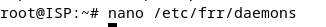{width="3.3963068678915134in"
height="0.28128937007874016in"}

Здесь мы входим в какую-то хуйню

{width="1.0730664916885388in"
height="0.21878062117235345in"}

Тут было «**нет**» , мы должны поменять на «**да**» , как на скрине

{width="6.5008617672790905in"
height="4.313001968503937in"}

Вводим оставшиеся команды **ISP** и на этом с ним все

**HQ-RTR:**

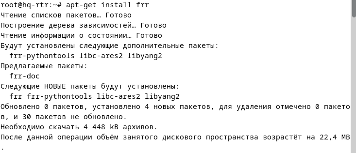{width="6.503202099737533in"
height="2.588160542432196in"}

Все вводим также как я объяснила выше, смотря на скрины и записи

{width="3.5734153543307086in"
height="0.20836286089238845in"}

Входим опять в эту хуйню

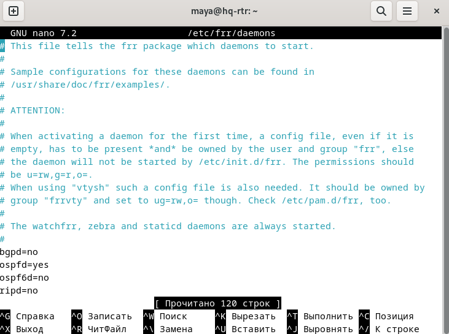{width="6.496527777777778in"
height="4.84375in"}

Здесь так же уже изменено словно «**нет**» , на «**да**»

{width="5.948746719160105in"
height="8.917911198600175in"}

Все вводим учитывая записи выше на листке , тут есть много ошибок,
поэтому нужно внимательно все учитывать и перепроверять

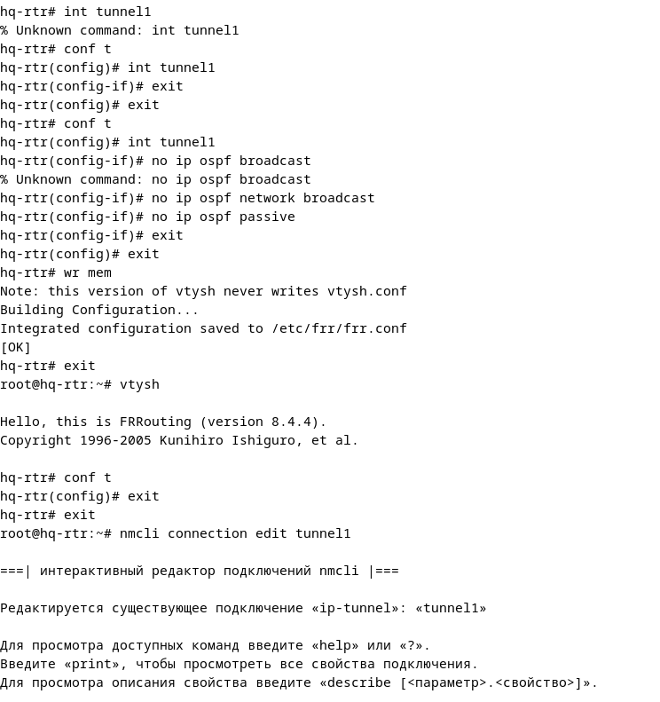{width="6.496527777777778in"
height="6.906944444444444in"}

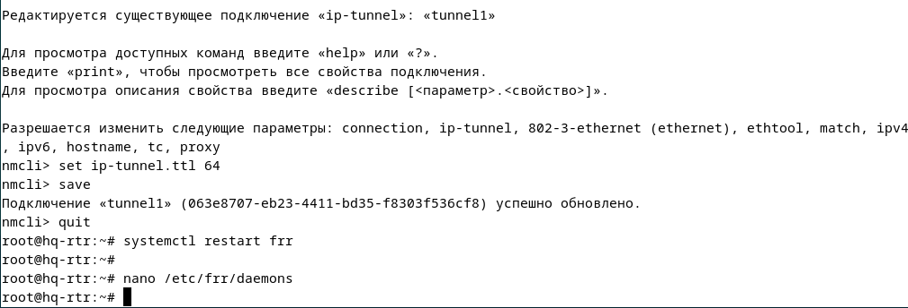{width="6.496527777777778in"
height="1.9461537620297462in"}

Если выходит , что **«редактируется существующее подключение**» то
значит все супер и делается все правильно и также **дописываем
оставшиеся команды**

**BR-RTR:**

{width="5.927910104986877in"
height="2.166969597550306in"}

Также мы вошли в **суперпользователя** , скачиваем какие-то пакеты

{width="3.5734153543307086in"
height="0.20836286089238845in"}

Снова входим в эту хуйню

{width="1.0730664916885388in"
height="0.21878062117235345in"}

И меняем «**нет**»» на «**да»**

{width="6.248588145231846in"
height="9.488412073490814in"}

Тут все также полностью как на записях, ничего нового

После этого всего мы настраиваем настройку разрешения пингов на ip
туннеле , потом настроили аутентификацию. В итоге это нужно сделать на
HQ-RTR и BR-RTR

HQ-RTR: и тоже абсолютно тоже самое прописываем на BR-RTR

{width="6.496527777777778in"
height="8.222222222222221in"}

В итоге нужно чтобы высвечивался туннель и чтобы были написан соседний
роутер, то есть : по цифрой 1 -- это туннель , а под цифрой 2 -- роутер

{width="6.496527777777778in"
height="1.0541666666666667in"}

{width="5.834146981627296in"
height="4.417283464566929in"}

Смотрим на таблицу 1 , от туда нам нужно глянуть HQ-SRV , CLI , BR-SRV ,
если быть точнее , то смотрим на адреса подсети

{width="6.496527777777778in"
height="3.2708333333333335in"}

Пример BR-RTR:

{width="6.496527777777778in"
height="2.04375in"}

На HQ-RTR пишется все почти тоже самое , меняется только адрес подсети
(где подчеркнуто)

И так как у нас у HQ-RTR есть сервер и комп, то им нужно записать 2
подсети , получается нужно 2 команды вот такие :

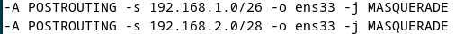{width="5.37575021872266in"
height="0.39588910761154855in"}

Так же нужно проверить появились ли эти подсети в помощью команды: cat
/etc/iptables/rules.v4

{width="6.496527777777778in"
height="2.3777777777777778in"}

ЕЩЕ ВОТ :

**HQ-RTR**

apt-get install iptables iptables-persistent

iptables --t nat --A POSTROUTING --s 192.168.100.0/26 --o ens36 --j
MASQUERADE ВЫБИРАЕМ ПОХОЖИЙ ENS НА 172.16.4.0

iptables --t nat --A POSTROUTING --s 192.168.200.0/28 --o ens36 --j
MASQUERADE ВЫБИРАЕМ ПОХОЖИЙ ENS НА 172.16.4.0

*4. iptables-save \> /etc/iptables/rules.v4*

*5. systemctl restart netfilter-persistent *

*6. systemctl restart iptables*

*Настройка динамической сетевой трансляции на BR-RTR*

apt-get install iptables iptables-persistent --y

iptables --t nat --A POSTROUTING --s 192.168.0.0/27 --o ens36 --j
MASQUERADE

ВЫБИРАЕМ ПОХОЖИЙ ENS НА 172.16.5.0

*4. iptables-save \> /etc/iptables/rules.v4*

*5. systemctl restart netfilter-persistent *

*6. systemctl restart iptables*

*7. cat /etc/iptables/rules.v4*

*Это методичка Ромы . как пример*

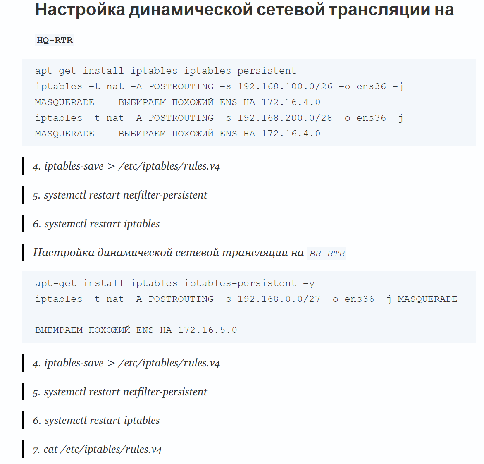{width="5.375878171478565in"
height="4.476933508311461in"}

Это с моей машины в итоге поучилось:

{width="6.496527777777778in"
height="3.9319444444444445in"}

{width="6.496527777777778in"
height="2.9472222222222224in"}

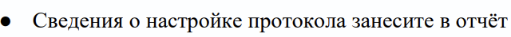{width="5.529820647419073in"
height="0.33510279965004375in"}

HQ-RTR

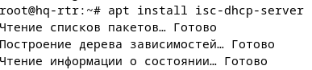{width="4.031812117235345in"
height="0.9063768591426071in"}

Установка пакетов

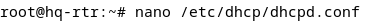{width="3.979722222222222in"
height="0.21878062117235345in"}

Заходим в какую-то хуйню

{width="6.291666666666667in"
height="2.5416666666666665in"}

Таблица масок ( 1 )

{width="5.6674573490813644in"
height="3.34421697287839in"}

Таблица подсети ( 2 )

{width="6.496527777777778in"
height="2.1222222222222222in"}

Таблица айпишников ( 3 )

{width="4.615227471566055in"
height="1.6877351268591425in"}

Это нужно прописать в этой хуйне , как это правильно записать:

1- подсеть ( HQ-CLI ) и маска ( HQ-CLI ) подсети ( рисунки выше )

2 строчка -- пул адреса HQ-CLI ( таблица 2 , в этой строчке нельзя
использовать в конце 1 , поэтому ставиться 2 )

3 строчка -- айпишник HQ-SRV ( таблица 3 )

5 строчка -- шлюз ( таблица 3 ) HQ-CLI ( всегда 1 на конце )

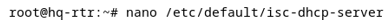{width="4.063066491688539in"
height="0.20836286089238845in"}

Заходим еще в какую то хуйню

{width="6.496527777777778in"
height="4.105555555555555in"}

Пишем ens39 , ( смотрим таблицу 3 , сначала на HQ-CLI потому что у него
дан 1 айпишник, и сравниваем , точнее ищем похожий на HQ-RTR не смотря
на последнюю цифру )

{width="6.496527777777778in"
height="1.9472823709536309in"}

Нужно написать так же как на скрине выше , при команде status
обязательно должно высветиться зеленый свет , если красный , то что-то
не так

HQ-CLI

{width="6.03209208223972in"
height="5.813311461067366in"}

Нужно найти похожий интерфейс ( ориентируясь HQ-RTR ens39 , опять таки
смотря на схожества одинаковых цифр ( не смотря на последнюю цифру )

ВСЕ КОНЕЦ

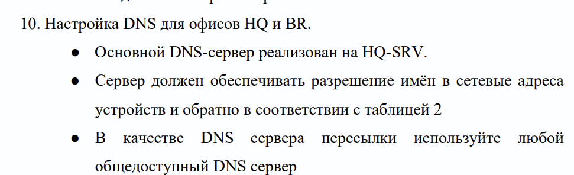{width="6.496527777777778in"
height="1.979861111111111in"}

HQ-SRV

{width="4.677736220472441in"
height="0.8126137357830271in"}

Скачивание пакетов

{width="2.917073490813648in"
height="0.2396172353455818in"}

Заходим сюда и прописываем нижнюю хуйню

{width="6.496527777777778in"
height="1.1347222222222222in"}

Короче на этом скрине всегда остается 127.0.0.1 , все остальные цифры
можно понять смотря на таблицы из задания 9

{width="4.042230971128609in"
height="0.8647036307961505in"}

Это просто прописываем

{width="2.0836242344706912in"
height="0.27087160979877517in"}

Заходим опять в эту хуйню

{width="6.292544838145232in"
height="1.8960979877515312in"}

Там уже будут прописаны некоторые строчки , нам нужно добавить на самый
вверх первые 3 строчки

{width="6.496527777777778in"
height="1.6243055555555554in"}

Проверка зоны

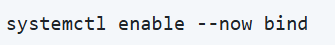{width="3.4900699912510937in"
height="0.46881561679790024in"}

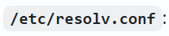{width="2.166969597550306in"
height="0.46881561679790024in"}

{width="3.2191994750656168in"
height="1.7502438757655292in"}

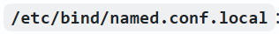{width="3.2921259842519683in"
height="0.40630686789151355in"}

{width="3.0837642169728783in"
height="1.3022648731408575in"}

Тут все пишется одинаково

{width="6.40714457567804in"
height="0.15627187226596675in"}

Копируется содержимое файла

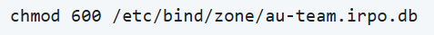{width="4.969443350831146in"
height="0.40630686789151355in"}

Тут также все одинаково

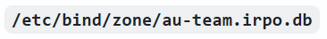{width="3.8130325896762907in"
height="0.45839676290463693in"}

Заходим сюда ( nano /.....)

{width="6.459234470691164in"
height="4.6360640857392825in"}

Прописываем также ( если задание не менялось ) если менялось смотрим на
таблицу 3 из задания 9 и от туда можно сравнить что от куда берется с
скрина

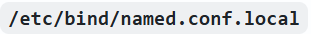{width="3.240034995625547in"
height="0.35421587926509185in"}

Заходим сюда ( nano /....)

{width="6.496527777777778in"
height="5.985416666666667in"}

Здесь нужно использовать только 2 сервера и комп ( HQ-SRV, HQ-CLI,
BR-SRV ) в такой последовательности

Смотрим на таблицу 2 ( задание 9 ) и адрес подсети пишем наоборот без
последней цифры ( 0 )

{width="6.496527777777778in"
height="0.7791666666666667in"}

Пишем все также используем HQ-SRV HQ-CLI BR-SRV ( таблица 2 )

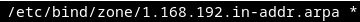{width="3.7505238407699037in"
height="0.22919838145231847in"}

Заходим сюда

{width="6.496527777777778in"
height="2.629861111111111in"}

**( На этом скрине и на некоторых снизу скопировалось немного не ровно ,
нужно обязательно чтобы было все ровно , иначе нихуя не будет работать
!!! )**

Здесь было чет написано, это нужно удалить и записать все на скрин выше

{width="5.448676727909011in"
height="4.521464348206474in"}

{width="6.496527777777778in"
height="0.5986111111111111in"}

Подчеркнутые цифры на скрине мы можем посмотреть на нашу схему, то есть
у HQ-RTR по схеме у нас на конце цифра 1 , а на HQ-SRV последняя цифра 2
, эти цифры нужно записать

{width="5.407004593175853in"
height="0.1250174978127734in"}

Заходим сюда

{width="6.496527777777778in"
height="2.2631944444444443in"}

Также нужно удалить все что там изначально написано и прописать то что
на скрине выше

Цифра 4 у нас стоит, потому что если посмотреть че написано в машинке
CLI ( ip -c a )

Там у ens37 на конце стоит 4 :

{width="6.42798009623797in"
height="1.1251574803149607in"}

Значит пишем 4

{width="3.979722222222222in"
height="0.22919838145231847in"}

Входим сюда

{width="5.75080271216098in"
height="2.771220472440945in"}

Удаляем все что там написано и прописываем скрин выше

Тут все таже можно посмотреть саму топологию у BR-RTR на конце 1 , а у
BR-SRV на конце 2

{width="1.9586067366579178in"
height="0.3125437445319335in"}

Эту команду нужно ввести на серверах и компе ( HQ-SRV CLI BR-SRV )

BR-SRV HQ-SRV

{width="2.9875in"
height="0.73125in"}{width="2.7751432633420823in"
height="0.8022069116360455in"}

CLI

{width="4.7858880139982505in"
height="1.0698884514435696in"}

Чтобы правильно записать айпишники можно посмотреть на топологию:

{width="5.448676727909011in"
height="2.4065857392825896in"}

Далее:

{width="2.2503138670166227in"
height="0.41672462817147854in"}

Этой командой нужно проверить есть ли ошибки на HQ-SRV:

{width="5.84456583552056in"
height="7.407283464566929in"}

Тут все также прописывается

{width="3.708850612423447in"
height="0.4375612423447069in"}

Перезагружаем этой командой

{width="5.584113079615048in"
height="2.2190594925634297in"}

**На CLI**

Далее проверяем работоспособность этой командой, прописывая айпишники 2
серверов и одного компа

{width="6.496527777777778in"
height="0.6868055555555556in"}

По заданию нам нужно настроить часовой пояс на всех машинках, для этого
нужно прописать команды:

{width="5.563276465441819in"
height="2.6253663604549433in"}

**Модуль 2**

**Данный модуль будет доп.. Задания здесь будут не все и не по порядку**

{width="6.496527777777778in"
height="1.082638888888889in"}

Открываем машинку CLI и прописываем :

**nano /etc/apt/sources.list.d/yandex-browser.list**

{width="5.782057086614174in"
height="0.27087160979877517in"}

После в этой хуйне мы пишем это:

**deb \[arch=amd64\] http://repo.yandex.ru/yandex-browser/deb beta
main**

{width="6.496527777777778in"
height="0.25625in"}

Сохраняем и выходим

Далее:

**wget <https://repo.yandex.ru/yandex-browser/YANDEX-BROWSER-KEY.GPG>**

{width="6.496527777777778in"
height="0.19375in"}

Следующие пункты также прописываются без каких либо поправок по порядку:

{width="6.528614391951006in"
height="0.5412587489063867in"}

1

{width="6.512299868766404in"
height="4.149617235345582in"}

2

{width="6.496527777777778in"
height="1.9861111111111112in"}

3 ( тут я использовала скрин повторных команд, поэтому написано мол уже
установлено и ничего не обновлено , ошибка не проблемная )

Какие использовались команды на последних 3 скринах:

**apt-key add YANDEX-BROWSER-KEY.GPG**

**apt-get update**

**apt-get install yandex-browser-beta**

**yandex-browser**

По итогу этого задания мы скачали яндекс, его можно тоже будет
заскринить и вставить в отчет

{width="5.323257874015748in"
height="4.174185258092739in"}

Задание выглядит страшно , а на деле совсем нет

Первым делом заходим на машинку BR-SRV и скачиваем пакет:

**apt-get install docker-compose -y**

{width="5.417422353455818in"
height="2.0106977252843397in"}

После заходим сюда:

{width="3.2608716097987753in"
height="0.2396172353455818in"}

И вводим это:

**При копии обязательно все по несколько раз перепроверить, а то будет
ошибка!!!**

version: '3.8'

services:

   mariadb:

   image: mariadb

   container_name: mariadb

   restart: always

   environment:

      MYSQL_ROOT_PASSWORD: rootpass

      MYSQL_DATABASE: mediawiki

      MYSQL_USER: wiki

      MYSQL_PASSWORD: WikiP@ssw0rd

  volumes:

      - mariadb_data:/var/lib/mysql

 

  wiki:

    image: mediawiki

    container_name: wiki

    restart: always

    ports:

      - 8080:80

    environment:

      MEDIAWIKI_DB_HOST: mariadb

      MEDIAWIKI_DB_USER: wiki

      MEDIAWIKI_DB_PASSWORD: WikiP@ssw0rd

      MEDIAWIKI_DB_NAME: mediawiki

#    volumes:

#      - ./LocalSettings.php:/var/www/html/LocalSettings.php

    depends_on:

      - mariadb

 

volumes:

  mariadb_data:

{width="6.03209208223972in"
height="7.813590332458443in"}

Далее вводим:

**docker-compose -f /root/wiki.yml up -d**

{width="5.354913604549432in"
height="2.8337292213473315in"}

После на этой же машине мы должны зайти в браузер!

{width="6.496527777777778in"
height="1.5173611111111112in"}

Заходим туда и пишем в поиск: 192.168.3.2:8080 ( до двоеточий написан
айпишник BR-SRV , а после так и оставляем

И того мы попадем вот сюда:

{width="5.615367454068242in"
height="3.1462718722659666in"}

Сюда у нас как раз и скачался наш пакет докер

Мы там устанавливаем медиа вики

Далее:

{width="6.496527777777778in"
height="8.61111111111111in"}

Пароль должен быть: WikiP@ssw0rd

{width="6.496527777777778in"
height="9.003472222222221in"}

Тут надо повторить тот же пароль

На следующем скрине мы изменяем только «темы оформления»

{width="5.365332458442695in"
height="4.125575240594926in"}

Ставим там кружочек

{width="6.4383989501312335in"
height="2.0419520997375327in"}

Нужно скачать этот файл

Далее мы обратно заходим в терминал и пишем это:

{width="5.896655730533683in"
height="0.4271434820647419in"}

У меня сама машина называется maya@br-srv , поэтому написано так ,нужно
записать само имя машинки и обязательно home

Далее пишем эту команду:

{width="5.125715223097113in"
height="0.8647036307961505in"}

После снова заходим в самый первый файл:

{width="3.333798118985127in"
height="0.22919838145231847in"}

Тут были решетки, нам их надо убрать , сохранить и выйти от туда

{width="5.896655730533683in"
height="0.9063768591426071in"}

Тут мы снова выполнили эту команду, дало уже другой результат:

{width="5.052788713910761in"
height="0.8334492563429571in"}

Далее мы выходим с терминала и снова заходим в браузер и опять вбиваем
это: 192.168.3.2:8080 , у нас должно высветиться главное меню

{width="6.496527777777778in"
height="4.519444444444445in"}

Готово , задание выполнено!!!

{width="6.496527777777778in"
height="4.259722222222222in"}

Работаем на машине HQ-SRV , сначала нам нужно добавить 3 диска по 1 гб ,
заходим в параметры машины , оборудование, добавить.. Hard Disk 3х по 1
гб

{width="6.499121828521435in"
height="4.127287839020123in"}

{width="1.929861111111111in"
height="1.1069444444444445in"}{width="4.55707895888014in"
height="1.1507370953630796in"}

{width="5.27186132983377in"
height="1.6988724846894139in"}

И таким образом 3 штуки, после обязательно перезагрузить машину

Далее скачиваем пакет:

{width="3.500488845144357in"
height="0.2396172353455818in"}

После : /sbin/mdadm \--create /dev/md0 \--level=5 \--raid-devices=3
/dev/sdb /dev/sdc /dev/sdd

{width="6.496527777777778in"
height="0.43333333333333335in"}

Далее:

{width="6.496527777777778in"
height="3.642361111111111in"}

Заходим опять в какую то хуйню

{width="3.052509842519685in"
height="0.1875262467191601in"}

{width="6.496527777777778in"
height="2.5756944444444443in"}

Далее:

{width="6.496527777777778in"
height="3.0743055555555556in"}

Далее идет настройка NFS также на HQ-SRV:

Идет скачивание пактов :

{width="4.6360640857392825in"
height="0.9167946194225722in"}

Пишем это:

{width="3.875541338582677in"
height="0.4375612423447069in"}

Далее заходим сюда:

{width="3.073345363079615in"
height="0.27087160979877517in"}

И пишем то что снизу черным написано , там айпишник с маской именно
HQ-SRV

{width="6.496527777777778in"
height="2.3916666666666666in"}И последние команды на этой машине:

{width="5.927910104986877in"
height="1.5210454943132108in"}

{width="4.677736220472441in"
height="0.21878062117235345in"}

Далее нам нужно перейти на машинку CLI

Устанавливаем пакеты:

{width="6.496527777777778in"
height="1.4180555555555556in"}

Далее:

{width="2.979582239720035in"
height="0.6771773840769904in"}

Заходим сюда:

{width="3.0316732283464565in"
height="0.16668963254593175in"}

Пишем там :

[192.168.2.1](https://vk.com/away.php?to=https%3A%2F%2F192.168.1.2&utf=1):/mnt/raid5/nfs
/mnt/nfs nfs defaults 0 0 ( это если что айпишник CLI )

{width="6.496527777777778in"
height="2.9770833333333333in"}

Далее нихуя потому что у меня полетела машина нахуй!!
